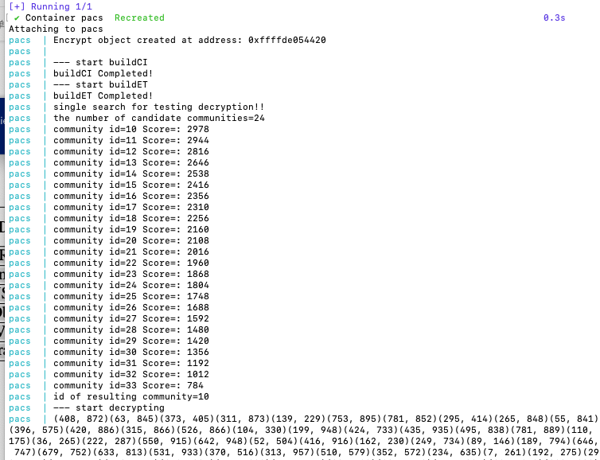
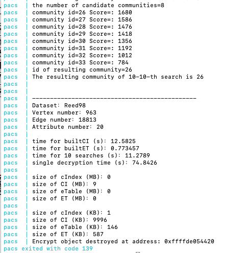

# PACS: Privacy-Preserving Attribute-Driven Community Search over Attributed Graphs

## Cryptographic Techniques

- **BGN** (Boneh-Goh-Nissim) homomorphic encryption
- **AIPE** (Asymmetric Inner Product Encryption)

## Dependencies

The project depends on the following libraries (all included in Docker image):
- GMP (GNU Multiple Precision Arithmetic Library)
- FLINT (Fast Library for Number Theory)
- PBC (Pairing-Based Cryptography Library)
- NTL (Number Theory Library)
- Crypto++
- OpenSSL
- libhcs (Homomorphic Cryptosystems Library)

## Hardware Requirements

Standard commodity hardware (desktop or laptop):
- **Minimum**: 2 CPU cores, 4GB RAM
- **Recommended**: 4+ CPU cores, 8GB+ RAM
- **Disk space**: ~5GB (for Docker image and datasets)
- **Architecture**: x86_64 or ARM64

## Software Requirements

- Docker Engine (version 20.10 or later)
- Docker Compose (optional, for convenience)
- Operating System: Linux or macOS
- Tested on: Ubuntu 22.04, macOS (ARM64/Apple Silicon)

## Quick Start

### Step 1: Build Docker Image

```bash
docker build -t pacs:latest .
```

Build time: approximately 5 minutes.

### Step 2: Run the Program

```bash
docker-compose up
```

Or run directly:

```bash
docker run --rm -it pacs:latest
```

This will automatically run the PACS program using the default dataset (Reed98) with 20 attributes.

## Expected Output

The program performs the following operations:

1. **Single Decryption Test** - Demonstrates the decryption process (only one decryption is performed to reduce runtime)

   

2. **Ten Privacy-Preserving Community Searches** - Automatically executes 10 attribute-driven community searches and displays the results

   

### Running Different Datasets

To run other datasets, modify the following in the source code and rebuild:
- `NODES_NUM`, `EDGES_NUM`, `ATTRIBUTE_NUM`, and `Max_Core` in `Encrypt.h`
- `datasetname` in `main.cpp` (line 399)

#### Available Datasets

| Dataset | Number of Vertices | Number of Edges | Max_Core |
|---------|-------------------|-----------------|----------|
| Reed98 | 962 | 18,812 | 35 |
| Simmons81 | 1,519 | 32,989 | 35 |
| USFCA72 | 2,683 | 65,253 | 44 |
| Oberlin44 | 2,921 | 89,913 | 50 |
| Vassar85 | 3,069 | 119,162 | 61 |
| Brandeis99 | 3,899 | 137,568 | 57 |

## Note on Data Preprocessing

**For code reviewers:** You do NOT need to run the `graph` program. We have already preprocessed all 6 datasets mentioned in the paper. The preprocessed data files are located in `data/output/` directory and ready to use.

The `graph.h` and `graph.cpp` files are provided for processing new datasets from raw edge lists (in `data/input/`).